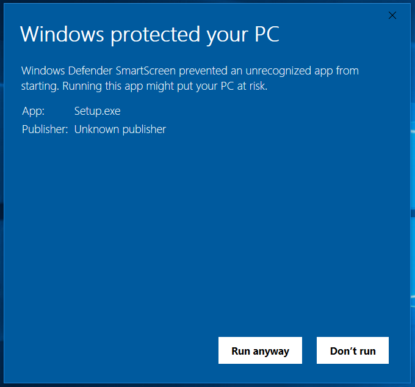

# Pull Request Monitor

A Windows system tray app to help you keep your team's Azure DevOps pull requests flowing smoothly.

**NOTE: This repository is no longer maintained.**

## Introduction

Pull requests have made code review a much more practical part of software development but it can still be tricky to strike the right balance between not interrupting other team members when a review is required and not being held up too long while waiting for a review. While [Azure DevOps](https://azure.microsoft.com/en-us/services/devops/) provides email notifications for pull requests, in a team where each developer generates one or more per day, these can pile up in your inbox and get stale fast.

Pull request monitor sits in your system tray continuously displaying the count of active pull requests in the configured Azure DevOps project. Left click the icon to bring up a view of the active pull requests, right click to access the settings window or to close the app.

## How to install and run

Download and run Setup.exe from the [latest release](https://github.com/nickform/pull-request-monitor/releases/latest). Unfortunately due to the lack of a code signing certificate for building the installer, Windows Defender Smartscreen on Windows 10, or maybe similar tools on older Windows versions, will pop-up, warning you about the risk of running an "unrecognized app". Click "More info" then "Run anyway".

